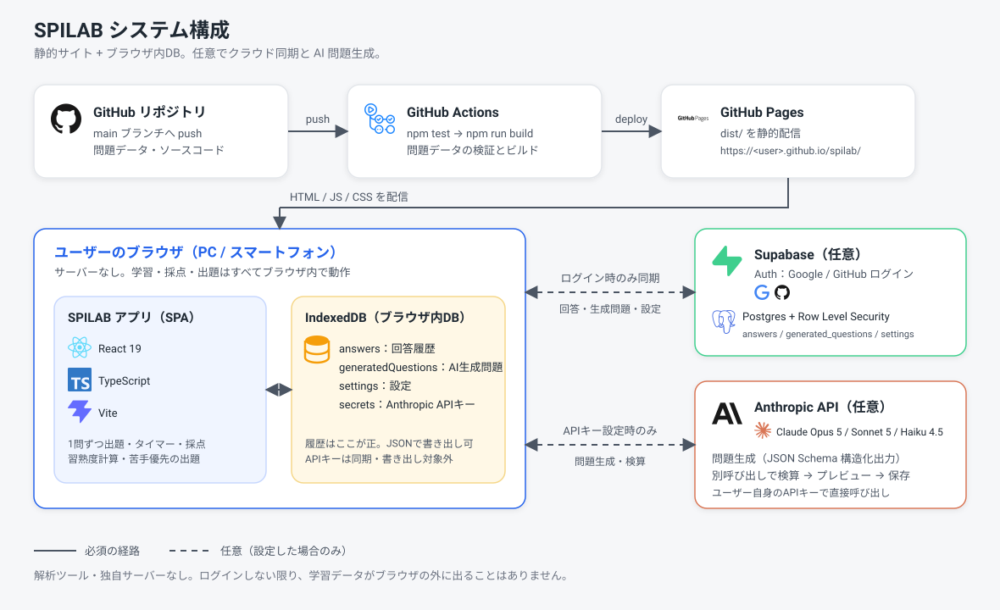

# SPILAB

転職活動向けの SPI 対策アプリ。1 問ずつ解いて、正解・不正解・「わからない」・解答時間を記録し、苦手分野を優先して出題します。

- **公開 URL**：`https://<ユーザー名>.github.io/<リポジトリ名>/`（GitHub Pages）
- **問題数**：17 分野・175 問。全問、作成後に独立して解き直す検証済み
- **学習履歴はブラウザ内に保存**。ログインしない限りサーバーには送信しません

## システム構成



| 要素 | 役割 |
| --- | --- |
| GitHub Pages + Actions | `main` への push で自動テスト・ビルド・公開 |
| ブラウザ（React / TypeScript / Vite） | 出題・タイマー・採点・習熟度計算をすべてブラウザ内で実行 |
| IndexedDB | 回答履歴・AI 生成問題・設定・API キーを端末内に保存 |
| Supabase（任意） | Google / GitHub ログインで複数端末の履歴を同期 |
| 問題作成 CLI（開発者用） | Claude で問題案を生成・検算し、レビュー後に問題データへ追加 |

## 使い方

1. ホームで「今日のSPIを始める」（既定 7 問、設定で 5〜15 問）
2. 「問題をはじめる」でタイマー開始 → A〜D または「わからない」→「解答する」
3. 採点・目安時間との比較・詳細解説を読んで次へ
4. 「履歴」で全体・分野別・問題別の成績を確認
5. 「設定」で学習データの書き出し／読み込み、クラウド同期

## 開発

```bash
npm install
npm run dev        # http://localhost:5173/spilab/
npm test           # ロジックと問題データの検証
npm run typecheck
npm run build      # dist/ を生成
```

Node.js 22 以上。

## セットアップ・問題の追加

GitHub Pages の公開手順、Supabase 同期の設定、問題データの追加方法、Claude による問題作成 CLI は [docs/setup.md](docs/setup.md) を参照してください。

## ライセンス

MIT License（[LICENSE](LICENSE)）
